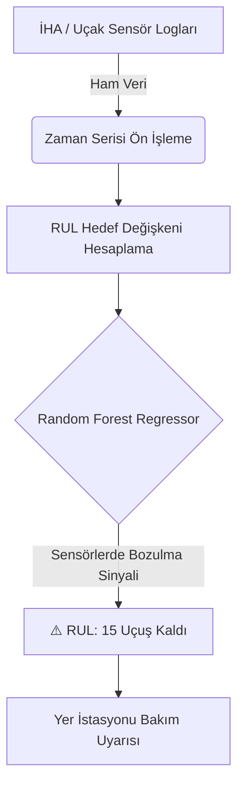

# ✈️ Havacılık Kestirimci Bakım (Predictive Maintenance) Sistemi


## 📌 Proje Özeti
Bu proje, havacılık ve savunma sanayiinde hayati öneme sahip olan **Kestirimci Bakım (Predictive Maintenance)** konseptini gerçek dünya verileriyle modelleyen bir yapay zeka sistemidir. Uçak/İHA motorlarındaki çeşitli sensörlerden alınan telemetri verileri analiz edilerek, motorun arızalanmasına kaç uçuş döngüsü (cycle) kaldığı önceden tahmin edilir.

## 📊 Açık Kaynak Veri Seti (Dataset)
**Projede sentetik veri DEĞİL, gerçek saha verileri kullanılmıştır.**
*   **Kaynak:** NASA Ames Research Center (C-MAPSS)
*   **İçerik:** 21 farklı sensör (Sıcaklık, basınç, fan hızı vb.)
*   **Kaggle Linki:** [NASA C-MAPSS Dataset](https://www.kaggle.com/datasets/behrad3d/nasa-cmaps)

## 🎯 İş Problemi ve Çözüm
**Problem:** Motor arızaları uçuş güvenliğini tehdit eder. Geleneksel "Reaktif" veya "Periyodik" bakım yöntemleri maliyetli ve yetersizdir.
**Çözüm:** Sensör verilerindeki bozulma trendlerini öğrenen bir makine öğrenmesi modeli (Random Forest Regressor) ile **Kalan Faydalı Ömür (RUL)** tahmini yapmak.

## 🏗️ Sistem Mimarisi (Telemetri Akışı)


## 📈 Model Performansı
```text
==================================================
HAVACILIK MOTOR ANALIZ RAPORU
==================================================
Hata Payi (RMSE): 17.84 Cycle (Ucus Degeri)
R2 Score: %90.15
==================================================
```
*(Modelimiz, bir motorun ne zaman arıza vereceğini ortalama 17 uçuş döngüsü sapma ile tahmin edebilmektedir.)*

## 📂 Proje Yapısı
```text
Predictive-Maintenance-NASA/
├── data/
│   ├── train_FD001.txt         # NASA Eğitim Verisi
│   └── test_FD001.txt          # NASA Test Verisi
├── src/
│   ├── data_loader.py          # NASA verisi ayrıştırma
│   └── predictive_maintenance.py # Model eğitimi
├── models/                     # Eğitilmiş RUL modeli
├── requirements.txt       
└── README.md              
```

## 💻 Programatik Kullanım
```python
from src.predictive_maintenance import NASARulPredictor

model = NASARulPredictor(model_path="models/rf_model.pkl")
# Motordan gelen anlık sensör verileri
sensor_verisi = [580, 15.2, 2380, 46] 
kalan_omur = model.predict_rul(sensor_verisi)

if kalan_omur < 20:
    print("⚠️ ACİL UYARI: Bakım Ekipleri Yönlendirilsin!")
```

## 🚀 Kurulum
```bash
git clone https://github.com/Umitsencer/Predictive-Maintenance-NASA.git
pip install -r requirements.txt
python src/predictive_maintenance.py
```

## 📜 Lisans ve İletişim
Bu proje **MIT Lisansı** ile lisanslanmıştır. Dilediğiniz gibi geliştirebilirsiniz.
- **Geliştirici:** Ümit SENCER
- **İletişim:** [LinkedIn Profilim](https://www.linkedin.com/in/umitsencer/)
```